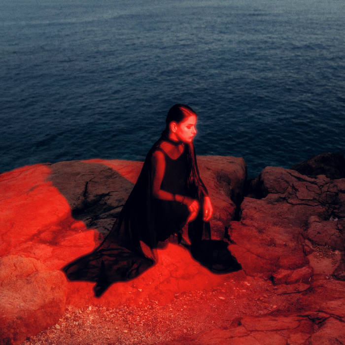

---
categories:
- Album Digest
date: "2023-12-31T18:35:06Z"
tags: 
 - Album Digest
 - Music
 - Twenty Three
 - Albums
 - Sofia Kourtesis
 - Electronic
title: "2023 Albums of the Year #1: Sofia Kourtesis, Madres"
slug: 2023-albums-01-sofia-kourtesis-madres
summary: "Good vibes, global beats, and the life changing effects of brain surgery abound in Sofia's debut."
---

Sofia Kourtesis is a Berlin-based Peruvian dance producer, "Madres" is her debut album which follows on from a 2021 EP "Fresia Magdalena". It was trailed by several singles, including the title track which caught my attention back in May. The album is dedicated to her parents and there are also songs dedicated to the surgeon who performed life-saving surgery on Kourtesis’s mother. The whole album is a heady mix of positivity and dedication to both music and to family. 

For me, ten years on from my trip to South America, I think my response to this album has been to its fusion of European and South American dance music, perhaps reminding me that it is possible to incorporate the experiences one has in other places into our viewpoint on the world. It seems to be that we are in a point in history that rather than acknowledging that we are interconnected and responsible for and to one another, that we have instead lurched into a protectionist and selfish mode of thinking. 

The urge towards connection and dancing is not irresistible, it can take a lot of effort to get moving, to open channels and to start to express your feelings. Sometimes it is effort that is not rewarded, sometimes even rejected. But an open heart is better than closed one, an open mind is better than a closed mind, and so you have to keep on trying. In the meantime, Madres presents a collection of songs that are by turns wistful, joyous, hopeful, and welcoming. 

Highlights include "Estacion Ezperanza" (a collaboration with Manu Chao), "How Music Makes You Feel Better", and "El Carmen". Most of the songs pulse as though they have their own life force, and there’s an incredible of sound detail in the songs, so they also have a twitching mental capacity to go with their pumping hearts and feet to the floor. There’s one exception “Moving Houses” which peels layers off itself and shifts slowly in place for six minutes; it has fewer immediate rewards compared to the other songs, but does begin to reveal itself on additional listening. 

This album came out in October and I didn’t listen to it quite as much as some other albums in this top ten, partly because as part of the promotion for the album Sofia produced a DJ mix for the Tim Sweeney’s Beats In Space show on Apple Music and I listened to that a ton as well. That mix also gets counted by the Albums app (post on this coming soon), and would have been a Top 20 if I’d decided to spend all of January 2024 writing about albums/mixtapes from 2023. That was where I encountered “Fiorucci Made Me Hardcore” by Barry Can’t Swim and “Nadia” by Anish Kumar. The whole mix is worth checking out so I’ve included it alongside the album below. So as not to deprive listeners on Spotify, I’ve also included her track IDs playlist which is unmixed (though you could try it with crossfade turned on) and much longer at 100 tracks.

<iframe allow="autoplay *; encrypted-media *;" frameborder="0" height="450" style="width:100%;max-width:660px;overflow:hidden;background:transparent;" sandbox="allow-forms allow-popups allow-same-origin allow-scripts allow-storage-access-by-user-activation allow-top-navigation-by-user-activation" src="https://embed.music.apple.com/gb/album/madres/1695712922"></iframe>

<iframe allow="autoplay *; encrypted-media *;" frameborder="0" height="450" style="width:100%;max-width:660px;overflow:hidden;background:transparent;" sandbox="allow-forms allow-popups allow-same-origin allow-scripts allow-storage-access-by-user-activation allow-top-navigation-by-user-activation" src="https://embed.music.apple.com/gb/album/beats-in-space-086-sofia-kourtesis-dj-mix/1704755392"></iframe>

<iframe style="border-radius:12px" src="https://open.spotify.com/embed/album/6zt8N56kz8b58cnHnBhx9f?utm_source=generator" width="100%" height="352" frameBorder="0" allowfullscreen="" allow="autoplay; clipboard-write; encrypted-media; fullscreen; picture-in-picture" loading="lazy"></iframe>

<iframe style="border-radius:12px" src="https://open.spotify.com/embed/playlist/37i9dQZF1DWVFhnU8yozBd?utm_source=generator" width="100%" height="352" frameBorder="0" allowfullscreen="" allow="autoplay; clipboard-write; encrypted-media; fullscreen; picture-in-picture" loading="lazy"></iframe>