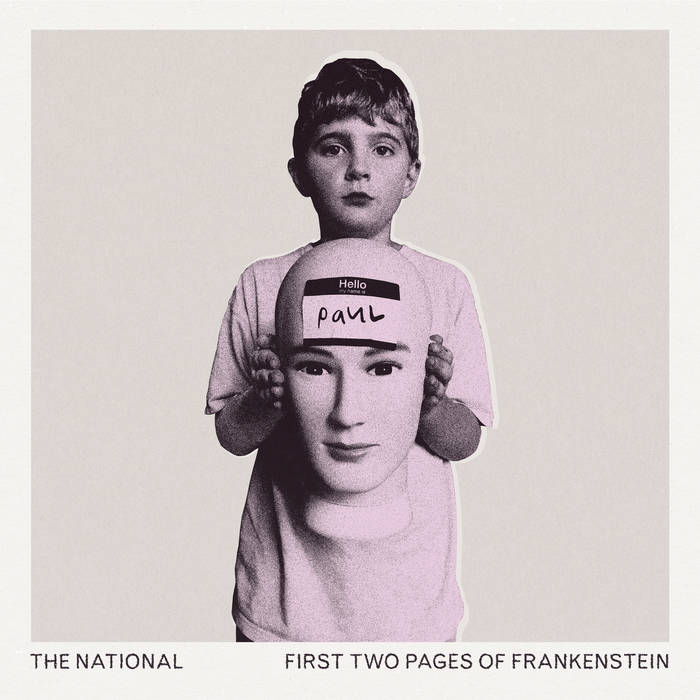
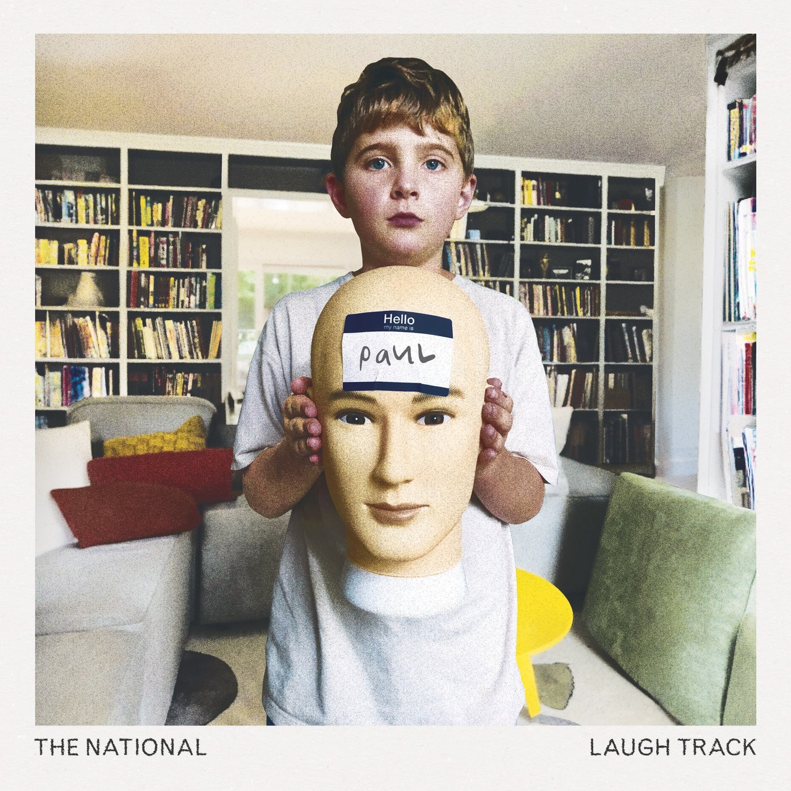

---
categories:
- Album Digest
date: "2023-12-28T18:35:06Z"
tags: 
 - Album Digest
 - Music
 - Twenty Three
 - Albums
 - The National
 - Rock
 - Indie
title: '2023 Albums of the Year #4: The National, "First Two Pages of Frankenstein" and "Laugh Track"'
slug: 2023-albums-04-the-national-frankenstein-laugh-track
summary: "Two new albums? And they're both better than the last one? And now with added Taylor Swift? You spoil us!"
---

It's probably no surprise that as we reach the top four (or five if you like) we also get to the two albums The National released in 2023. The first, “First Two Pages of Frankenstein”, was trailed with a big reveal early on in the year, while the second, “Laugh Track”, was dropped all of a sudden in October. Once I got to know both albums, I swung between liking each one more for a while, hence putting them both at the same point in the list and not considering each separately. 

For the purposes of this list, we can consider both albums as one homogeneous collection of songs, though some reviews did pick out that “Laugh Track” has more live drums and the songs on that latter album are looser and longer than their “… Frankenstein” counterparts. I think there are songs that are similar to one another on both albums, and that for those tracks, the song on the first album is a bit better than the one on “Laugh Track”. Some of the songs on “Laugh Track” are almost invisible on the first few listens, songs like “Dreaming”, “Hornets” and “Tour Manager”, though the latter of those three has become one of my favourite songs on both albums.

Other songs tread old ground. “Space Invader” has a “Sliding Doors” kind of story to it that is common to a lot of songs by The National, while “Your Mind Is Not Your Friend” has a similar chiming riff to “Exile / Vilify” the song that they contributed to the Portal 2 soundtrack. That’s perfectly fine of course. I’m just glad that they didn’t think the weird instrumental interludes and pretentious story structure from “I Am Hard To Find” were in need of replication. They’ve certainly earned the right to repeat themselves and while neither of these albums is going to replace “High Violet” or “Boxer” as go-tos when I want to listen to The National, the same was also true of “Sleep Well Beast” and “I Am Hard To Find”. We’re at the point where we get the odd great song that reminds us how good they are.

On “Laugh Track” (which from this article is reading very much like my favourite of the two) that song is “Smoke Detector”. I fell in love with The National as a band the first time I ever heard them, which was in the Moles club in Bath when the DJ played “Mr. November”. I even went and asked the DJ what it was, and anyone who knows me will know that I wouldn’t normally do that. I went and bought “Alligator” the next day, and then spent a few months navigating a record on which no other song sounded like “Mr. November”. And of course, that song has the reputation of being like none of the others, the one that they use to close live sets. They certainly did it when I saw them and I think they continue to do so. Anyway, “Smoke Detector” is not “Mr. November 2: the novembering” by any means, but it does have a lovely loose feel to it that occasionally gets ragged and could very well take on an extra energy and intensity at a gig. I look forward to seeing if that’s case whenever I can next get tickets!

If I had comments enabled, I'd ask you what portmanteau of these two album tracks you would prefer. But I don't, so you'll have to email me.

<iframe allow="autoplay *; encrypted-media *;" frameborder="0" height="450" style="width:100%;max-width:660px;overflow:hidden;background:transparent;" sandbox="allow-forms allow-popups allow-same-origin allow-scripts allow-storage-access-by-user-activation allow-top-navigation-by-user-activation" src="https://embed.music.apple.com/gb/album/first-two-pages-of-frankenstein/1660282625"></iframe>

<iframe allow="autoplay *; encrypted-media *;" frameborder="0" height="450" style="width:100%;max-width:660px;overflow:hidden;background:transparent;" sandbox="allow-forms allow-popups allow-same-origin allow-scripts allow-storage-access-by-user-activation allow-top-navigation-by-user-activation" src="https://embed.music.apple.com/gb/album/laugh-track/1704171991"></iframe>

<iframe style="border-radius:12px" src="https://open.spotify.com/embed/album/5Mc6uebYtKnRc5I7bjlNB6?utm_source=generator" width="100%" height="352" frameBorder="0" allowfullscreen="" allow="autoplay; clipboard-write; encrypted-media; fullscreen; picture-in-picture" loading="lazy"></iframe>

<iframe style="border-radius:12px" src="https://open.spotify.com/embed/album/7re8T0K3s8v3S3xeiQcOYi?utm_source=generator" width="100%" height="352" frameBorder="0" allowfullscreen="" allow="autoplay; clipboard-write; encrypted-media; fullscreen; picture-in-picture" loading="lazy"></iframe>