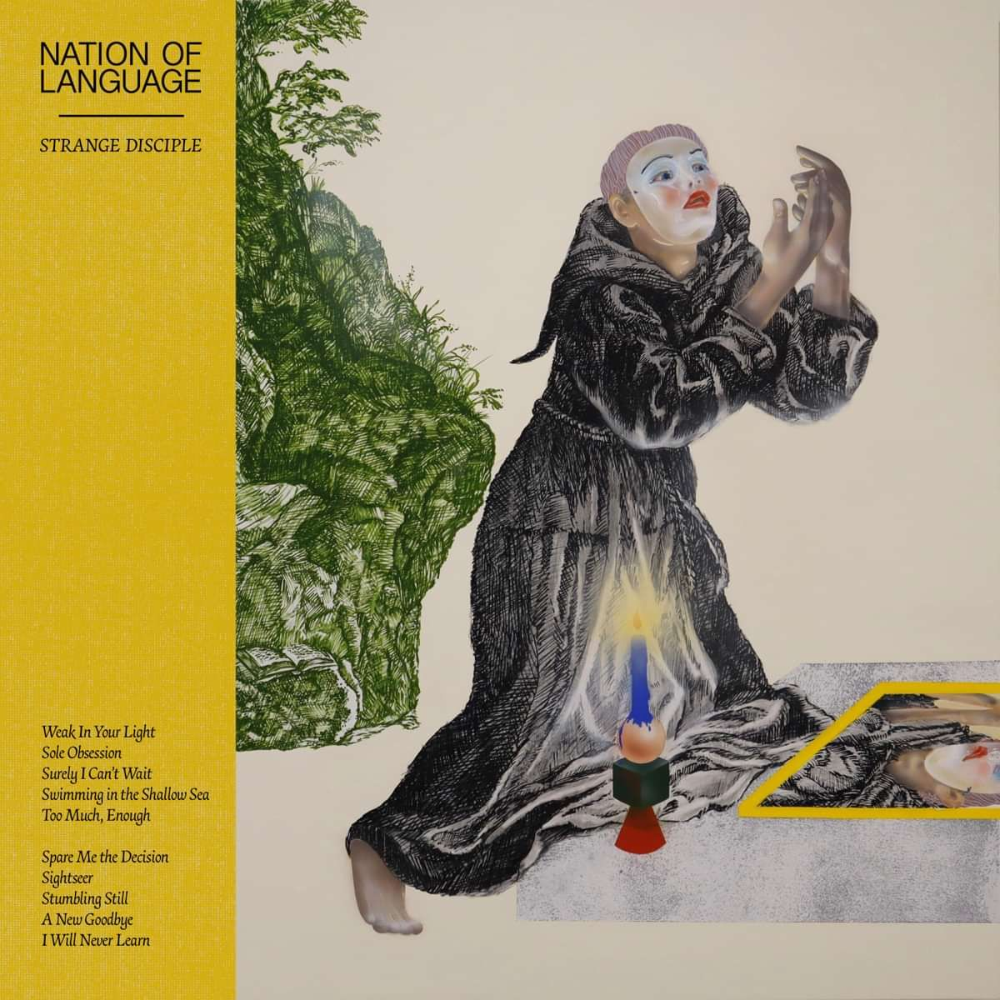

---
categories:
- Album Digest
date: "2023-12-27T18:35:06Z"
tags: 
 - Album Digest
 - Music
 - Twenty Three
 - Albums
 - Nation of Language
 - Electronic
 - Indie
title: "2023 Albums of the Year #5: Nation of Language, Strange Disciple"
slug: 2023-albums-05-nation-of-language-strange-disciple
summary: "Chilly and delicate synth missives from the lockdown."
---

It would be remiss of me to claim that this is a placeholder for any number of (quite different sounding) song based albums that came out this year (Yves Tumor, Wilco to mention two) but it feels that way. This album came high up my list of listens because it's a very good breakfast album, one to listen to while getting the Day started - though there are also some bangers on here too. 

Nation of language are a three piece band from New York. I think one of them is famous for being in a band I've not heard of (or is that their producer, I must do some fact checking) and two of them are married, even going so far as to have had a gofundme or whatever for the band as a present at a wedding. (That doesn't give off future "we are a duo now" vibes at all!)

They've released three albums since 2020, this being the first they've been properly able to tour. I've listened to their second album (“A Way Forward“) quite a bit too and the thing that strikes me is how much less suited to a live setting some of the tracks on the third album are. It's almost as of faced with the outside world, the band withdrew a bit and started to write these insular songs, some of which are glorious. 

"Sole Obsession" will be fine live, it's one of the songs of the year for me. It has a nice 80s feel, reminiscent of OMD. I really love the "take me home and walk away" chorus as it puts me in mind of a particular person from my past. But then there are songs like "Swimming In The Shallow Sea", "Stumbling Still" and "I Will Never Learn". All of these will probably be fine live too but are much more pristine and intricate. That fragility and sensitivity is one of the advantages of synths over electric guitars. 

<iframe allow="autoplay *; encrypted-media *;" frameborder="0" height="450" style="width:100%;max-width:660px;overflow:hidden;background:transparent;" sandbox="allow-forms allow-popups allow-same-origin allow-scripts allow-storage-access-by-user-activation allow-top-navigation-by-user-activation" src="https://embed.music.apple.com/gb/album/strange-disciple/1680897071"></iframe>

<iframe style="border-radius:12px" src="https://open.spotify.com/embed/album/1VDxaxECCJJh4of5htFnmK?utm_source=generator" width="100%" height="352" frameBorder="0" allowfullscreen="" allow="autoplay; clipboard-write; encrypted-media; fullscreen; picture-in-picture" loading="lazy"></iframe>