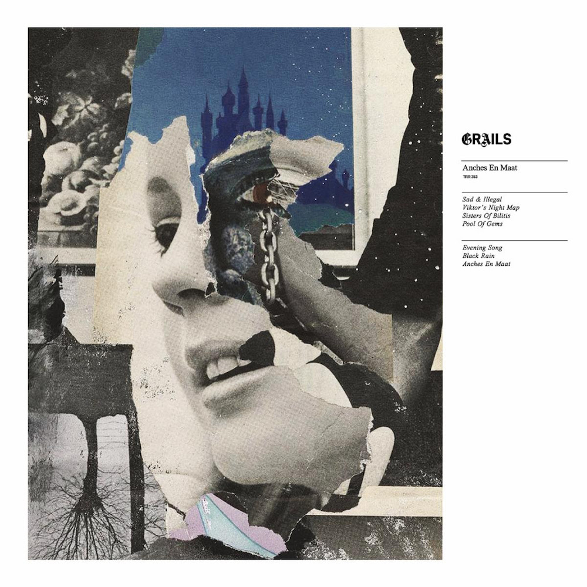

---
categories:
- Album Digest
date: "2023-12-26T18:35:06Z"
tags: 
 - Album Digest
 - Music
 - Twenty Three
 - Albums
 - Grails
 - Rock
title: "2023 Albums of the Year #6: Grails, Anches en Maat"
slug: 2023-albums-06-grails-anches-en-maat
summary: "Grails' latest album gives you plenty to lose yourself in (for forty minutes at least)."
---

Grails are one of those bands who always get played a lot at my house. There's something about their slow incremental instrumental pieces that my brain just loves to get lost in. Anches en Maat, their first album in six years or so, and the first with the entire band in the studio together since 2008, is their most Grails-y album in a long time. 

On their last album Chalice Hymnal there were a lot of references to various band members' side projects like Watter and Lilacs & Champagne, along with continuations of pieces from earlier albums like Deep Politics. Anches en Maat seems to clear all that away while retaining their signature sound, a bit like a reboot rather than a reinvention. 

I'm no expert on these matters - and Grails' music has always been too serpentine and elusive for me to pin down - but it feels more cohesive to me. There are beautiful little twitching synths at some points that twitch and tap away at the edge of the mix holding in the other sounds and directing them, whereas I think on Chalice Hymnal those same elements might have been grafted on as part of a patchwork. I'm probably not describing the difference properly but it feels much more than the sum of its parts. 

There are only seven tracks and with a runtime of forty odd minutes it feels made for a vinyl runtime. Certainly I've not really learned the titles of the individual tracks so much. A lot of it is very cinematic and it's a nice album to use as an alarm. Though it can be rather disconcerting to be decanted from the realm of dreams into what sometimes sounds like a noir movie!

<iframe allow="autoplay *; encrypted-media *;" frameborder="0" height="450" style="width:100%;max-width:660px;overflow:hidden;background:transparent;" sandbox="allow-forms allow-popups allow-same-origin allow-scripts allow-storage-access-by-user-activation allow-top-navigation-by-user-activation" src="https://embed.music.apple.com/gb/album/anches-en-maat/1691945419"></iframe>

<iframe style="border-radius:12px" src="https://open.spotify.com/embed/album/7LeY5PPAemD8mv4n6Je4iM?utm_source=generator" width="100%" height="352" frameBorder="0" allowfullscreen="" allow="autoplay; clipboard-write; encrypted-media; fullscreen; picture-in-picture" loading="lazy"></iframe>
