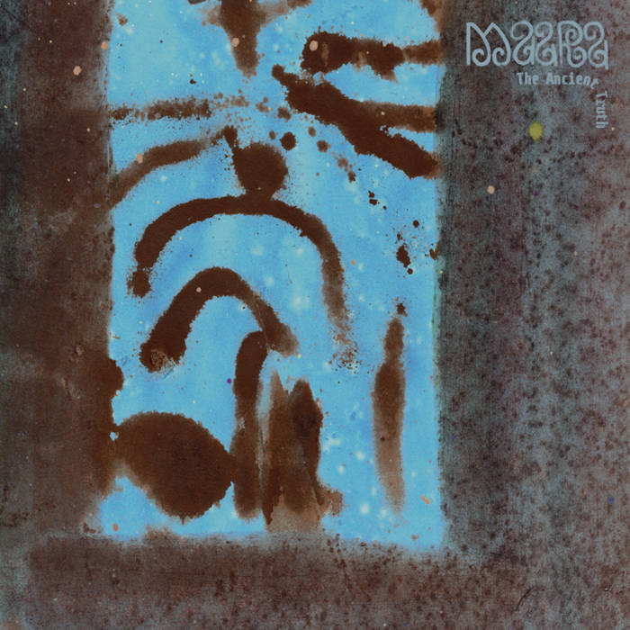

---
categories:
- Album Digest
date: "2023-12-25T18:35:06Z"
tags: 
 - Album Digest
 - Music
 - Twenty Three
 - Albums
 - Maara
 - Electronic
title: "2023 Albums of the Year #7: Maara, The Ancient Truth"
slug: 2023-albums-07-maara-ancient-truth
summary: "Because sometimes you can be relaxed by drum and bass. Sometimes."
---

There isn't a great deal I can write about The Ancient Truth without sounding vague and anodyne. While I try to come think about different forms of music and go into some analysis of what makes one album more interesting than another, sometimes you end up just saying "this album is great because I like it and I always have a good time listening to it."

The album has a late nineties early naughties kind of feel, all skittering breakbeats and chilly pads, but it also features a modern chill out vibe perhaps in keeping with recent reappraisals of music by artists like Enya. In short, it's very relaxing. 

I bought a set of AirPods Pro this year. Apple's gone big on Spatial Audio and I've spent a bit of time getting caught up in the immersion of it. But perhaps the biggest sign of just how good AirPods are is how well the software in them makes little indie dance records like this sounds like they've been mastered for the immersive capacities of Spatial Audio. I remember walking listening to this on a very warm day in September and feeling very contained with the beautiful sound world of this album. 

In conclusion this a great album if you love downtempo headphones music. It is great for walking to, working to, and having a little shimmy to. It progresses from breakbeats in the tracks towards the beginning of the album, into deeper more trancey cuts later on. I'd love a copy on vinyl but I'm not sure that's possible outside of Canada. 

<iframe allow="autoplay *; encrypted-media *;" frameborder="0" height="450" style="width:100%;max-width:660px;overflow:hidden;background:transparent;" sandbox="allow-forms allow-popups allow-same-origin allow-scripts allow-storage-access-by-user-activation allow-top-navigation-by-user-activation" src="https://embed.music.apple.com/gb/album/the-ancient-truth/1683022578"></iframe>

<iframe style="border-radius:12px" src="https://open.spotify.com/embed/album/5STK4lk9JLkQOCadRoNKQR?utm_source=generator" width="100%" height="352" frameBorder="0" allowfullscreen="" allow="autoplay; clipboard-write; encrypted-media; fullscreen; picture-in-picture" loading="lazy"></iframe>