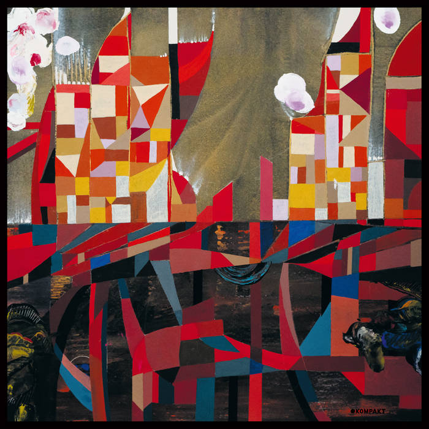

---
categories:
- Album Digest
date: "2023-12-22T18:35:06Z"
tags: 
 - Album Digest
 - Music
 - Twenty Three
 - Albums
 - Wata Igarashi
 - Electronic
title: "2023 Albums of the Year #10: Wata Igarashi, Agartha"
slug: 2023-albums-10-wata-igarashi-agartha
summary: "Anyone for Japanese Techno via German kosmische music and Philip Glass operas?"
---

Agartha is the debut album by Japanese electronic artist Wata Igarashi. I don't really know much about him, but I do know that I enjoy releases on the German record label Kompakt and I have really enjoyed Japanese techno in recent years. Over lockdown I discovered Haruomi Hosono's "Polyharmony" album and re-discovered the work of Shinichi Atobe, particularly their album "Love of Plastic". Both of those albums could be future understated classics and while both are by Japanese artists working in electronic music, there the comparison ends.

The fact that Agartha is released on renowned German techno label Kompakt will give you plenty of clues to its sound, though as the year wore on I became impressed with just how German-sounding the album is. There's a Neu!-like quality to early track "Subterranean Life" and other tracks put me in mind of the great album "Tago Mago" by CAN. The influences are not just German though, there are hints of Philip Glass towards the end of "Ceremony of the Dead" with its minimalist choral arrangements.

I think one of the tracks was featured on Tim Sweeney's Beats in Space radio show, which I've found to be a consistent source of good new music this year (probably the aforementioned "Subterranean Life" or the title track), and then the album got a good review on Resident Adviser. Strangely the album was not reviewed on Pitchfork, which means I have had to think for myself about why I like this album so much. 

Part of the reason is tracks like "Floating Against Time" which have a dreamlike quality to them, full of floaty arpeggios and glorious modular washes. It's the sort of electronic music that I love to lose myself in. Literally in some cases, as I think this is one of the albums I have most often fallen asleep to  this year. I have said on plenty of occasions that this is not a bad quality for an album to have!

<iframe allow="autoplay *; encrypted-media *; fullscreen *; clipboard-write" frameborder="0" height="450" style="width:100%;max-width:660px;overflow:hidden;border-radius:10px;" sandbox="allow-forms allow-popups allow-same-origin allow-scripts allow-storage-access-by-user-activation allow-top-navigation-by-user-activation" src="https://embed.music.apple.com/gb/album/agartha/1680488959"></iframe>

<iframe style="border-radius:12px" src="https://open.spotify.com/embed/album/5kuzeufUirI4eXJ3VEYZOO?utm_source=generator" width="100%" height="352" frameBorder="0" allowfullscreen="" allow="autoplay; clipboard-write; encrypted-media; fullscreen; picture-in-picture" loading="lazy"></iframe>
