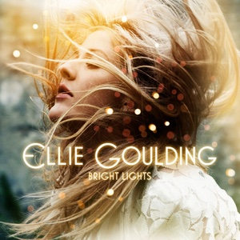

---
categories:
- Music
date: "2023-06-08T00:00:00Z"
tags:
- Music
- Album Revisit
- Ellie Goulding
- Pop
- Twenty Three
title: Ellie Goulding - Bright Lights
---
So today [my random album script](/how-random-should-things-be/) picked out "Bright Lights" by Ellie Goulding, an album I wasn't sure I've ever listened to. I looked in my music library and there it was! As a result this is not so much an [album revisit](/tag/album%20revisit/) as an album __visit_.

Anyway, this album was released in 2010 and did quite well. In fact, "Bright Lights" is a reissue of an album that was originally released as "Lights" (February 2010). This version adds seven extra tracks, which explains why it's an exhausting seventeen tracks long. "Lights" was a successful debut and a few of the singles went top 20, which is what led to its re-release with all those extra songs in November of the same year. (I think this is why it is in my collection, I think I bought it for my mum or for a sibling as part of a Christmas present, and ripped the CD out of curiosity...)

Reader, I lasted six songs. Those six songs weren't bad, especially at a time when Chvrches didn't exist yet. But they were pretty formulaic and definitely came from a time when producers were keen to accentuate strange and kooky ways of enunciating words, especially at the crucial point of each song. It's fun the first time, but it begins to pall at about the third or fourth time _in a row_. There's lots of stuttering synths that suggest it wasn't just me listening to BT trying to make pop songs around the same time. There are some dated stylistic choices such as the breathless _a capella_ closing lines of "Guns and Horses" (with a similar trick at the end of "Under The Sheets"), but otherwise it's precise and polished pop music. I lack the vocabulary to describe what's going on musically, but everything sounds pretty metronomic and click-tracked, with the acoustic guitars sounding so 'present' in the mix they can only be sampled. 

I don't think I need to write much more. Thirteen years later these songs held my attention even less than they would have when they were released. You could listen to them while on hold for internet banking but there's nothing to get a tattoo over. 
