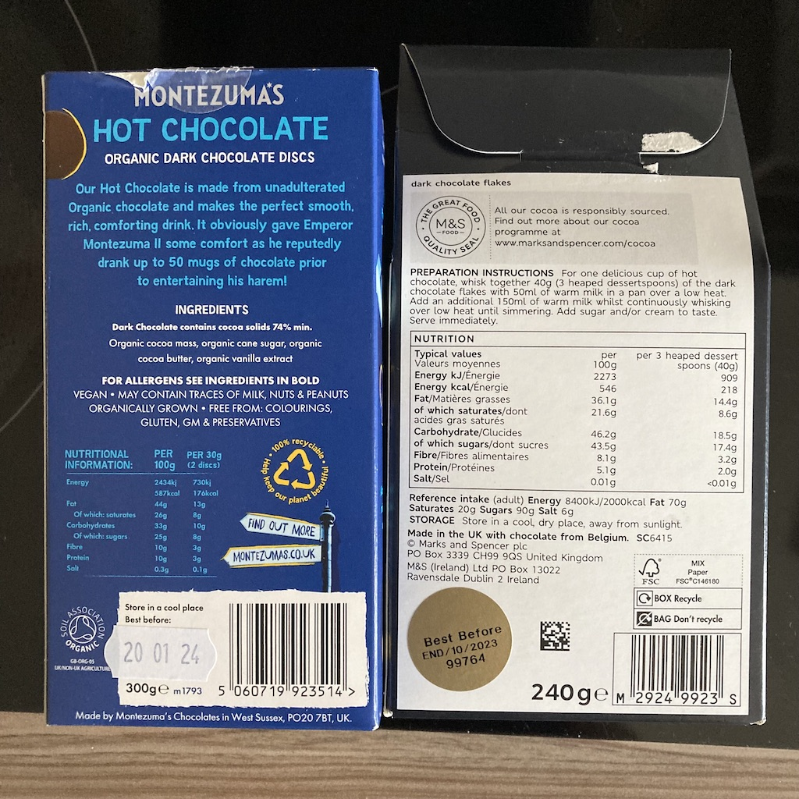

---
categories:
- Food
date: "2023-06-07T00:00:00Z"
tags:
- Food
- Hot Chocolate
- Recipes
- Chocolate
- Twenty Three
title: Hot Chocolate Comparison
---
I'm a massive fan of hot chocolate. Recently a friend recommended M&S hot chocolate flakes. Thanks to a promotion it was about half the price of the Montezuma's hot chocolate discs that we usually buy. The Montezuma's ones are lush (that's official hot chocolate tasting terminology) but in this economy anything that saves a bit of money has got to be good right?

However, there are other things to consider. For one, what's the cost per drink? After reading the instructions for the M&S hot chocolate, it was clear that it might not make as many drinks as the Montezuma's hot chocolate does.  That said, we prefer to use one disc rather than the suggested two,  and sure enough, we also found that we only needed about half the hot chocolate when using the M&S flakes too. Nevertheless you still get 66% more drinks from the Montezuma's hot chocolate. 

But Montezuma's hot chocolate is darker and contains a lot less sugar than the M&S stuff. They're a bit closer though when it comes to saturated fats. You can see this from the helpful photo below with the nutritional information of both side-by-side. 

In case the writing is too small, let me summarise with the following table:

| Property                                | M&S  | Montezuma's |
| --------------------------------------- | ---- | ----------- |
| Number of drinks per pack               | 6    | 10          |
| True number of drinks per pack          | 12   | 20          |
| Sugar per 100g (chocolate only)         | 43.5 | 25          |
| Saturated Fat per 100g (chocolate only) | 21.6 | 26          |

So the Montezuma's chocolate seems a bit healthier and you almost get double the drinks from the box, which kind of justifies the higher price in my opinion.
