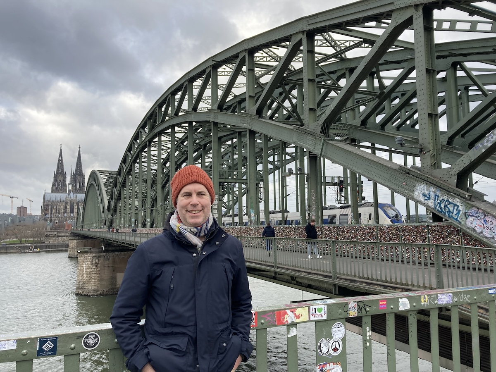
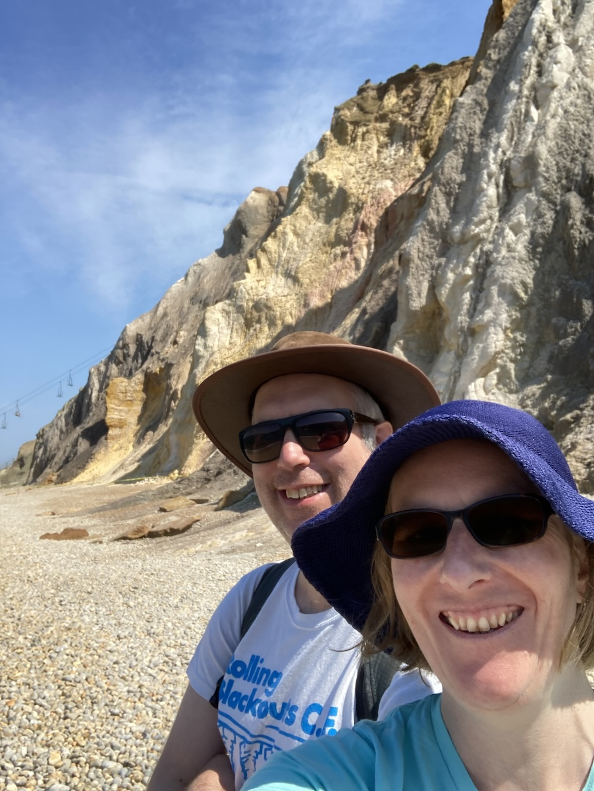
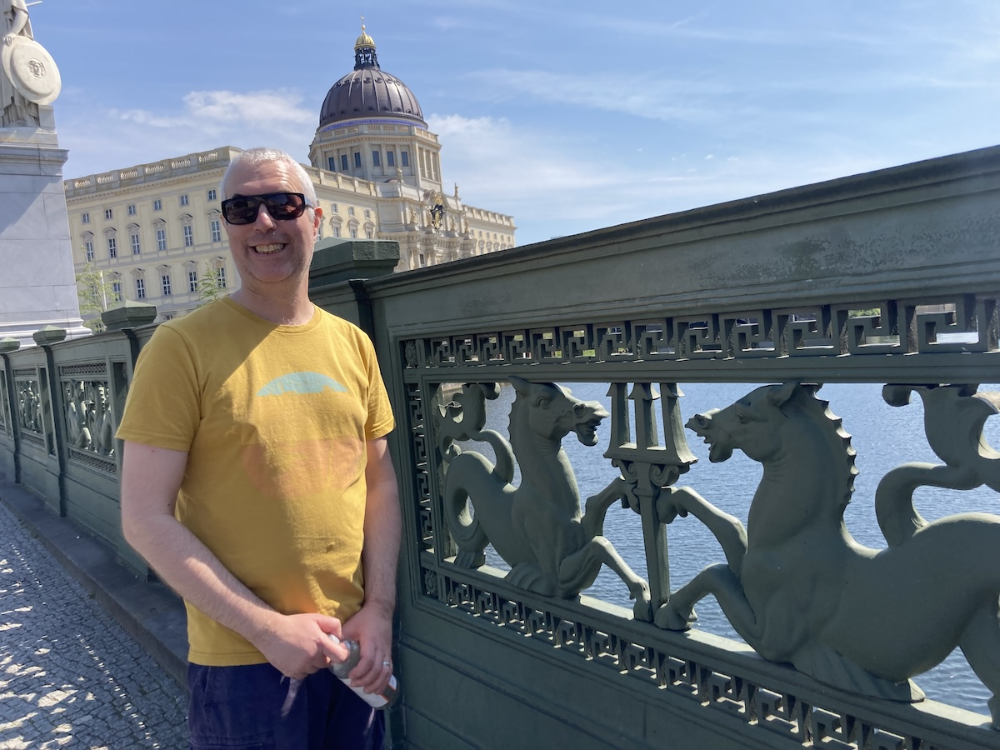
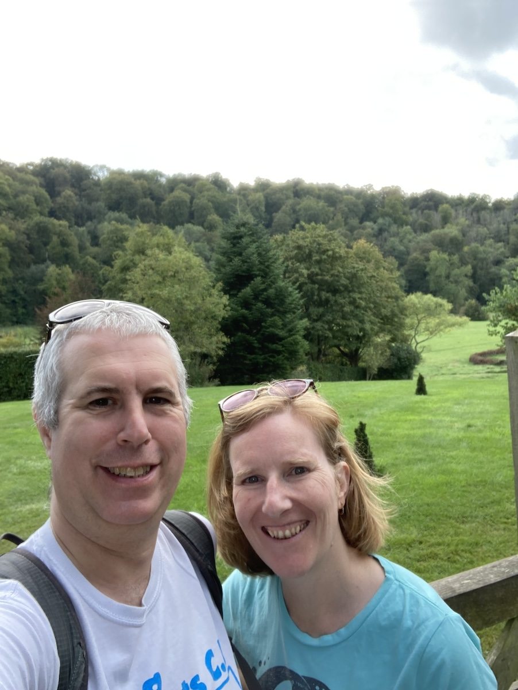

## Travel

In 2023, it was Germany or go home.

Went to Cologne in January. Here is photographic evidence:

We took the Eurostar via Brussels. A bit of a long day on the way back but much less stressful compared to flying.

We went to the Isle of Wight in June. It was the first time I'd been since I was about 8. This time I didn't get Chicken Pox. Anyway, here is photographic evidence:

Went to Berlin in July. Here is photographic evidence:

We flew with Easyjet. It feels like everything has fallen apart compared to pre-Brexit. (A flight to and from Germany in 2019 was pretty mediocre too, so it's not just the pandemic.) Anyway, the train is way better - but would have also taken about 15 hours and been a lot slower. 

But Berlin was lovely. It was the tail end of a long heatwave, so the whole city felt drawn out and tired. Coming in from the non-event of a British summer this year it felt exciting. And of course, Berlin is so many places all in one place. A bit like London but with fewer wankers.

Less close to home, but not involving a ferry ride, we went to Gilbert White's house in September. Here is photographic evidence (both of going there and that I should have had a hair cut beforehand):

I probably need to travel more in 2024, but as mentioned above, it seems so difficult right now.

## Books

Three books/series I liked in 2023:

1. The Final Architecture series by Adrian Tchaikovsky. Two books into this trilogy and it's really interesting. The earth gets blown up eighty years before the book starts and things continue from there. I also read the third of AT's "Children of Time" series this year, "Children of Memory", which was about 400 pages devoured in four days.
2. I've started reading Proust. The more noteworthy achievement will be whether I manage to finish. I'm really enjoying it, but it's so different to other writing. It's so detailed and full of references to lost things, it's a world unto itself. It's absolutely compelling and I've barely scratched the surface so far. I will write more about my reasons for reading Proust in another post when I get closer to the end.
3. I really enjoyed reading Alan Rickman's diaries. He had what seemed like a very hectic but very enjoyable life. It has inspired me to be more brief in my writing, but also to capture more of what I do. I don't feel like I do very much by comparison, but am motivated to take up that challenge. Especially as the diaries start when Alan was my age. 

I've started keeping a book log, just to motivate myself to read a few more books. There are so many unread books hanging out rent-free in our house and I'd love to crack them open and feast on the gooey secrets inside them. And the longer your nose spends in a book, the less time that it spends pressed up against your phone.

## Work

There was evolution rather than revolution at work. My direct report left us for a better job, while my own role was upgraded and put into alignment with some very talented colleagues. The chance to regularly discuss work with them has definitely been a change for the better.

I keep learning new things, but don't seem to get much chance to apply them. This means that new techniques don't seem to stick like they used to. I'm going to try and make a difference to that in 2024.

What would my dream job be? I'm well into my forties and I still don't know. I probably won't figure it out any time soon! For the time being, it's probably more about making my current job into my dream job, rather than setting off into the wild blue yonder.

## Things I Watched

* Drops of God
* Foundation season 2
* Drive My Car
* Strange Way of Life
* One Piece

## Continued adventures in blogging

Integration of git and SSG is fun.

I still need to learn more CSS though.

I am still very distrustful of JavaScript frameworks (React etc) and of JS generally. That is probably changing but I do need to give myself more chances to find out what I can do, and that means actually doing things.

As for writing, it's fun. And despite things like Chat-GPT, it's never been more important to think and write, and to write and think.

## What I want to do more of in 2024

Finish things.

Take more photos.

Make more of a difference in the world. It doesn't have to be huge, it just has to be something.

Write more code.