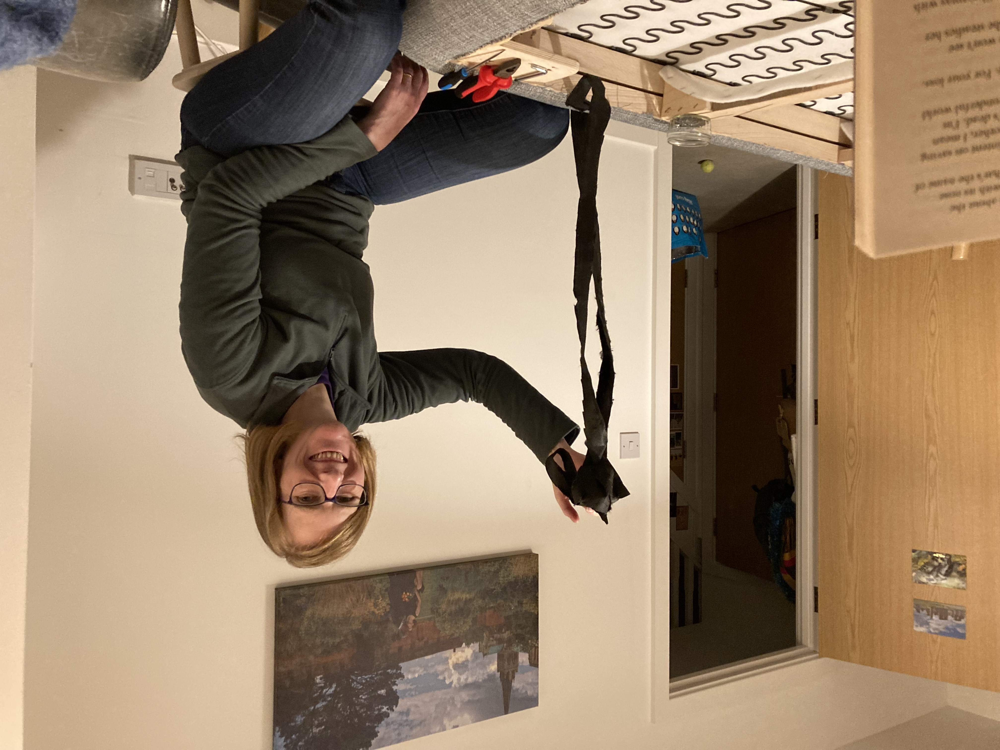

Once upon a time, a cat named Nerys ripped into the bottom of our sofa to make herself a cozy burrow. This was all well and good, except for the times when she would do it when we were using the sofa too. On these occasions (and presumably on most others) she would proceed to sharpen her claws on what remained of the fabric. (A less charitable reason for this behaviour would be that she was simply widening the whole for her future self after eating more and more kibbles!)

I was convinced that I had photographic evidence of this but apparently not. I'm aware that it would only look like a picture of cat's eyes staring out of a hole under a sofa. Not a big challenge for the AI image generation bot of your choice.

Anyway, this claw-sharpening sound from *inside* the sofa drove us both a bit batty. So we resolved to remove the existing fabric and replace it with some canvas we bought at the haberdashers. Obviously part one of the project was getting hold of the canvas and the necessary staple gun. Part two has been the rest of it. Both parts have been subject to delays. The whole thing has had the feel of that "draw the rest of the owl" meme.

This one:

Anyway, by way of an update, the fabric is off the bottom and some of the original staples have been pulled out. Ingrid did the staple tugging, while I read bits of Ali Smith's "Winter" to her. DIY-wise I'm only useful as a sort of posh bootleg Audible at this point.

Photographic evidence (of sofa progress, with a glimpse of my attempts at pivoting to audiobooks):

Next steps: Staple the new fabric to the bottom of the sofa. I have a feeling this will take a while. I may even have to do something more useful like hold the fabric tight. We may need actual audiobooks to play my existing role.
